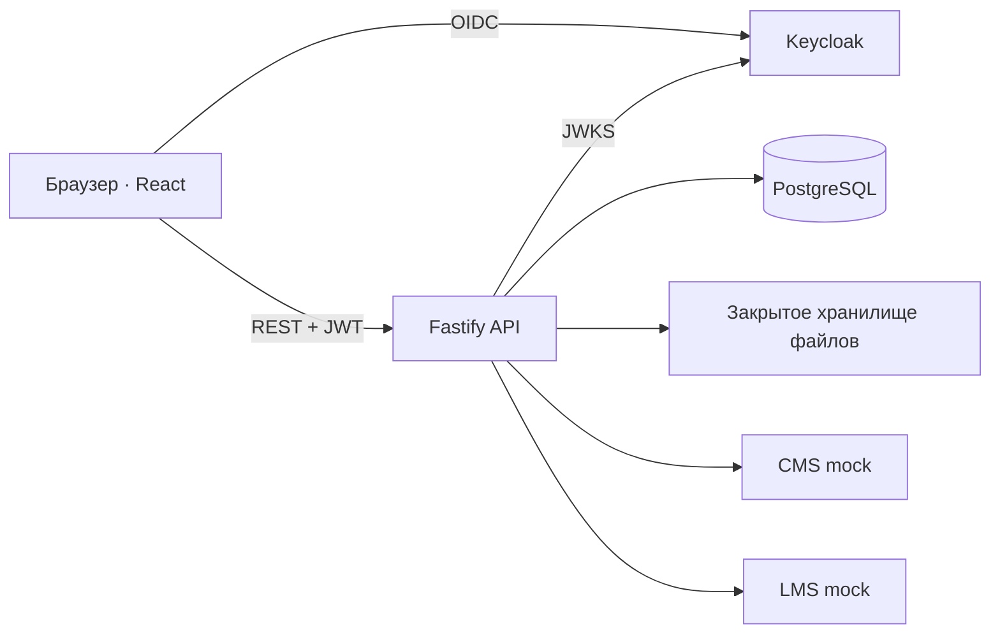

# Документация · РТК CRM

Это краткая точка входа для оценки решения. [Открыть CRM](https://crm.futura.team/) · [Отправить заявку](https://crm.futura.team/request/) · [Посмотреть Figma](https://www.figma.com/design/kTMqGGpBwiPckoJk5VxCBo?node-id=145-1209).

## Задача и решение

Команда ИТ Школы ведёт три типа взаимодействия: с вузами, отдельными слушателями и компаниями. CRM связывает в одном месте запрос, ответственного КАМ, задачи, историю контактов и переходы по стадиям. Руководитель видит портфель и движение команды, администратор настраивает доступ и справочные процессы. Карточка организации объединяет связанные активности, но каждая активность остаётся самостоятельной.

| Процесс | Основной путь |
| --- | --- |
| Вуз | Первичный контакт → встреча и потребность → документы и согласование → внедрение → завершение. Внутри карточки доступны контрольные пункты U01–U13 и сквозной обзор U14. |
| Индивидуальное обучение | Запрос → консультация → условия → передача в LMS → итог сопровождения. Ранее начатые заявки сохраняют прежнюю версию маршрута. |
| Корпоративное обучение | Потребность компании → бриф и оценка → согласование программы → подготовка запуска → завершение. План различает готовую программу, адаптацию и новую разработку. |

## Роли и возможности

- **КАМ** ведёт доступные ему активности, контакты, задачи и историю, видит свою очередь и уведомления.
- **Руководитель** видит командный портфель в своей области доступа, нагрузку и просрочки, назначает ответственного.
- **Администратор** управляет пользователями, правами, схемой вузовского процесса, инструкциями и обменами; бизнес-данные доступны ему только при соответствующей совмещённой роли.

Есть импорт с предпросмотром, отчёты и выгрузки, вложения, светлая/тёмная темы и адаптивный интерфейс. Публичная страница принимает три вида входящих обращений в CRM. Подробные действия и команды локального запуска — в [руководстве проекта](../crm/README.md), а статус проверок — в [реестре качества](../crm/docs/QUALITY.md).

## Архитектура

API проверяет роль и область доступа на сервере. PostgreSQL хранит бизнес-записи и аудит, файлы и готовые отчёты — в закрытых каталогах. CMS/LMS mock позволяют показать интеграционные сценарии, но не являются подключением к инфраструктуре заказчика. Полная [архитектура и модель данных](../crm/docs/ARCHITECTURE.md) и [границы интеграций](../crm/docs/INTEGRATIONS.md) описаны отдельно.

## Границы демонстрации

Стенд создан для хакатона и использует демонстрационные записи. Отчётные показатели трактуются как данные CRM в доступной роли; они не подменяют продажи, оплату или фактическое число выпускников. Для промышленной эксплуатации потребуются подключение и согласование API заказчика, решение по персональным данным, мониторинг и дополнительные проверки нагрузки и восстановления.
