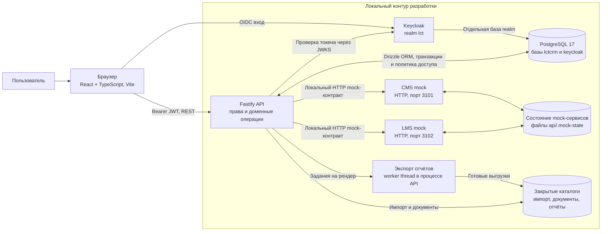
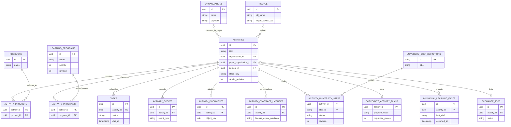

# Архитектура локальной CRM

Этот документ описывает текущий локальный демонстрационный срез. Все данные стенда синтетические; подробные сценарии, API и ограничения отдельных пакетов собраны в [README CRM](../README.md).

Редактируемый [источник схемы для импорта в Archi](../delivery/lct-crm-architecture-open-exchange.xml) подготовлен в формате ArchiMate Open Exchange XML с одним видом компонентов и обменов. XML проверен на целостность ссылок и прошёл валидацию `xmllint` по XSD Diagram/View/Model из [репозитория Archi OpenGroupXMLExchange](https://github.com/archimatetool/OpenGroupXMLExchange) с локально разрешённой зависимостью W3C `xml.xsd`; импорт и визуальная компоновка в Archi пока не проверены, поскольку Archi на этой машине не установлен.

## Компоненты

Веб-клиент отвечает за рабочие экраны и обращается к API. API повторно проверяет подписанный Keycloak JWT, роль и область записи на каждом защищённом действии; проверки интерфейса не заменяют серверные. PostgreSQL — источник бизнес-данных и состояний заданий. Compose поднимает один сервис PostgreSQL с отдельными базами `lctcrm` и `keycloak`; API использует первую, Keycloak — вторую.

В `lctcrm` хранятся организации, контакты, продукты, активности и их стадии, задачи, история, договорно-лицензионный контекст с точностью срока, контрольные пункты вузов, корпоративные планы, учебные факты, provenance импорта, задания/события обмена, статьи инструкций с ревизиями и аудитом, решения по рекомендациям и snapshots/задания отчётов. Файлы документов, исходные файлы импорта и готовые отчёты лежат отдельно в закрытых локальных каталогах `.local-storage/`; для импорта PostgreSQL также хранит разобранную нагрузку и состояние предпросмотра. Каталог состояния CMS/LMS mock находится в `api/.mock-state/`.

Ключевые связи текущей CRM-модели (это укрупнённая ER-схема; точные ограничения и все служебные таблицы задают миграции):

`LearningProgram` — самостоятельная программа/курс с ручным приоритетом; связи с активностями хранятся отдельно от продуктовых. Число связанных активностей для каталога считается по действующей области пользователя и не интерпретируется как число продаж или обучающихся.

`organization_id` и `payer_organization_id` — две разные необязательные ссылки на организацию; для B2C обе могут отсутствовать. Контакт `people` не является учётной записью Keycloak. `individual_learning_facts` хранит только полученную проекцию, не вторую LMS. Связи workflow (`workflow_stages`, `workflow_transitions`) задаются ключами типа/стадии/версии маршрута, а отчётные снимки и задания — отдельными таблицами `report_jobs`/`report_snapshot_rows`; они не раскрыты в этой укрупнённой схеме.

Основные сведения активности (контакт, продукты, приоритет) изменяются одной транзакцией с проверкой `details_revision`; новый контакт создаётся как отдельный `Person`, без выдачи роли или учётной записи CRM. Событие изменения остаётся в истории, а стадия и организационные связи не затрагиваются.

Администратор меняет единую схему вузов через предпросмотр и подтверждение. API показывает последствия для всех вузовских активностей; применение схемы и перенос затронутых стадий происходят одной транзакцией с проверкой ревизии и токена предпросмотра. Для перехода вузовской активности API требует текущую ревизию схемы и проверяет её вместе со стадией и разрешённым ребром под блокировками БД. Конфликт требует обновить карточку или предпросмотр; другие типы активностей этим изменением не затрагиваются.

Фильтры отчёта применяются один раз в repeatable-read транзакции; строки сохраняются в `report_snapshot_rows`, а `report_jobs` хранит метрики и параметры. API отдаёт страницы по 25 строк и рассчитывает показатели по полному срезу. Worker thread строит выгрузку по тому же snapshot. Перед выдачей страницы или файла API повторно проверяет область доступа и полноту строк.

Выгрузки отчётов записываются в `report_jobs`; локальная очередь API передаёт формирование файла в отдельный Node.js worker thread и сохраняет результат на диск. Одновременно рендерится не более одного файла на процесс API, worker имеет отдельный лимит heap, а готовый файл ограничен 100 MiB. Во время работы процесса recovery повторно отправляет только задания в состоянии `queued`; переход зависших `running` обратно в очередь делается только при старте процесса, когда прежний worker уже не жив. После перезапуска API незавершённые задания поднимаются из PostgreSQL. Отдельного брокера сообщений или выделенного сервиса обработки заданий в этом контуре нет. Импорт выполняется по шагам через API: загрузка и предпросмотр не меняют бизнес-записи; подтверждение выбранных строк записывает результат в PostgreSQL.

## Доступ

| Роль | Область и действия |
| --- | --- |
| КАМ (`kam`) | Свои активности и импортированные им записи; работа с задачами, историей, карточками и доступными действиями. Может атомарно забрать ещё не назначенное CMS mock-обращение из краткой общей очереди. |
| Руководитель (`manager`) | Командный портфель и операции CRM в доступной области. Может передать обычную активность действующему КАМ после предпросмотра; личные импортированные записи исключены. Ограниченные владельцем импорта контакты и активности не становятся общими из-за этой роли. |
| Администратор (`admin`) | Техническая схема вузов, публикация инструкций, доступ известных пользователей, обезличенные состояния обменов и импорта, управление демонстрационными сбоями. Одна роль `admin` не открывает карточки, контакты, подтверждение импорта и бизнес-отчёты; совмещённая роль `manager+admin` даёт командный бизнес-доступ. |

Для импорта действует отдельная область: загрузчик читает собственное задание, предпросмотр и каталог кандидатов. Проверка области выполняется сервером и повторяется при выдаче отчёта или файла. Для конкретных endpoint и исключений см. таблицы B01, B08–B12 в README.

Список назначаемых КАМ синхронизируется из локального Keycloak при запуске стенда; отключённые там аккаунты не выдаются для назначения при следующей синхронизации. Администратор может отключить доступ известному пользователю CRM. Политика в PostgreSQL проверяется на каждом запросе и не сбрасывается при повторном provisioning; отключённый КАМ исключается из назначения. Изменение требует причины и записывается в аудит. Роли Keycloak остаются верхней границей прав: CRM не выдаёт новые роли, а отзыв роли в Keycloak применяется к существующему JWT после его обновления или истечения. Область по процессам настраивается отдельно от роли, проверяется сервером для активностей и отчётов, включая ранее сохранённые выгрузки. Организационные области также настраиваются по ID организации: все ненулевые ссылки на клиента и плательщика должны входить в разрешённый список, а физлицо без организационных ссылок остаётся доступным в своей процессной области. Для выбора администратор видит только ID, название и тип организации. Самостоятельные контакты и поставщики без связи с активностью сохраняют область исходного владельца, а глобальный каталог продуктов не делится по процессам. После передачи карточка, документы и сохранённые отчёты проверяются по текущему владельцу, а события об авторстве остаются неизменными. Сервер проверяет бизнес-роль по сопоставленному маршруту и повторно внутри импорта; технические ответы администратора скрывают имена клиентов, исходные события и служебные ключи обменов.

## Основные потоки

- **Импорт:** API проверяет XLS/XLSX или JSON, временный файл хранит в закрытом каталоге, а предпросмотр — в PostgreSQL. После подтверждения пользователем выбранные строки записываются в бизнес-таблицы одной операцией.
- **Внешний обмен:** действия пользователя или ручной pull администратора обращаются только к локальным CMS/LMS mock. Задания и события сохраняются в PostgreSQL; факты обучения поступают как отдельная read-only проекция LMS.
- **Отчёты:** API фиксирует фильтрованный срез в PostgreSQL, UI читает его страницами, а worker thread готовит файл. Проверка области доступа выполняется повторно при чтении и скачивании.

Подсказки по стадиям берутся из одного каталога CRM. Руководитель сохраняет черновик статьи, администратор публикует её с привязкой к текущему снимку стадии; изменение схемы делает старую привязку неактуальной. Контекстная рекомендация выбирается правилами по открытым задачам и текущей стадии; отклонение/отложение сохраняются для пользователя и активности. В этом срезе нет внешнего генеративного сервиса.

CMS/LMS здесь — локальные HTTP mock-сервисы с фиксированными демонстрационными контрактами и сохраняемым файлом состояния. Обмен инициируется CRM-действиями или ручным pull администратора; подключений к системам заказчика и фонового расписания синхронизации нет. CMS обращение становится активностью CRM с источником и внешним ключом. CRM может запросить в LMS подготовку доступа; ответ «принято» не означает зачисление. Факты зачисления, начала и завершения поступают отдельными LMS-событиями и хранятся в CRM как read-only проекция.

## Границы текущего среза

- Это локальная демонстрационная среда со стартовыми workflow, тестовыми ролями и синтетическими записями, а не утверждённая промышленная архитектура.
- Реальные CMS, LMS, сайт и учётные системы не подключены. Нет согласованных с заказчиком API, credentials, расписания и семантики фактов; mock не подтверждает их реальное поведение.
- В срез не входят миграция пользователей в корпоративный IdP, промышленное развёртывание Keycloak, брокер/выделенный сервис обработки заданий, общий объектный файловый storage, расписание автоматических копий, HA и эксплуатационные SLO. `verify-backup-restore.mjs` проверяет восстановление PostgreSQL на отдельной синтетической базе, а `verify-file-backup-restore.mjs` отдельно копирует и проверяет документы, отчёты и CMS/LMS mock-файлы в закрытом локальном каталоге. Между снимком БД и файлов нет общей атомарной точки восстановления.
- Учебные факты — только проекция полученных событий. CRM не ведёт курсы, содержимое, оценки, сертификаты, платежи или реестр обучающихся. Плановое число мест не равно зачислениям.
- Для реальных персональных данных и запуска у заказчика нужны согласованные требования к хранению, доступу, аудиту, срокам удаления и инфраструктуре; локальная конфигурация этого не утверждает.
